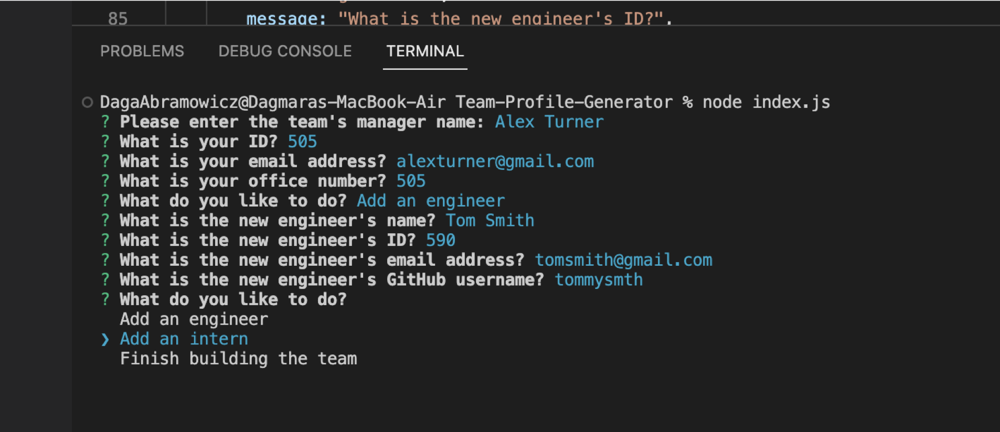

# Team Profile Generator

  ## Table of Contents
  * [Description](#description)
  * [Installation](#installation)
  * [Usage](#usage)
  * [Contributing](#contributing)
  * [Tests](#test)
  * [Licence](#licence)

  ## Description
  This is a command-line application that takes in information about employees on a software engineering team, then generates an HTML webpage that displays summaries for each person.

  

  ## Installation
  Open the terminal and use node in the command line

  ## Usage
  By answering questions you can create a Team Profile
  
  

  ## Contributing
  Everyone is welcomed to contribute to this project

  ## Tests
  To run tests, run the following command - npm test

  ## Licence
  This product is licenced under the  licence